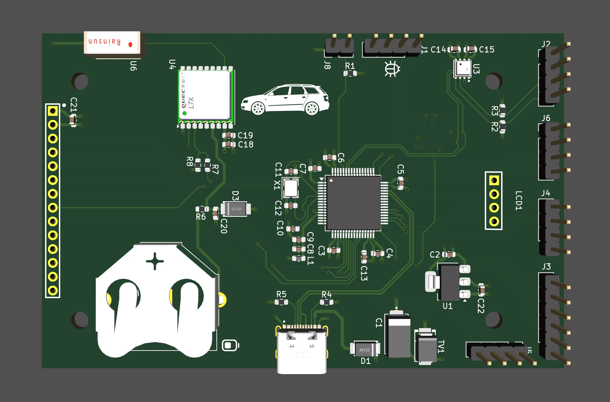
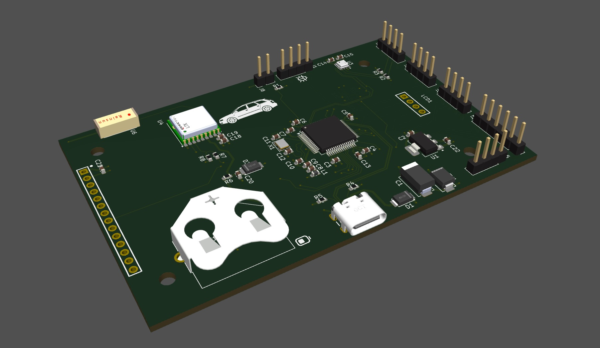
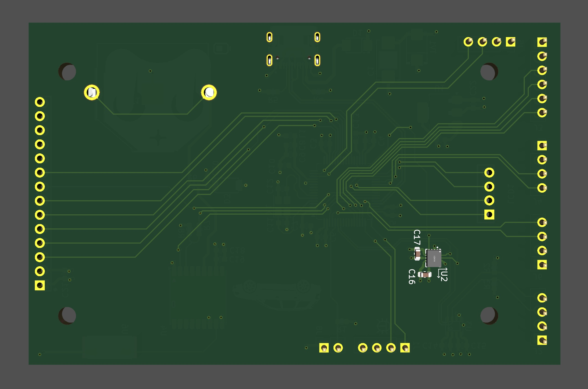
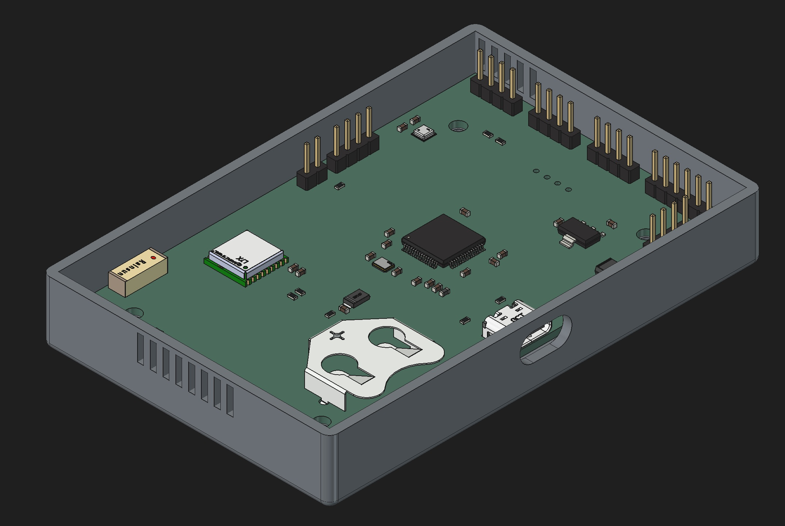
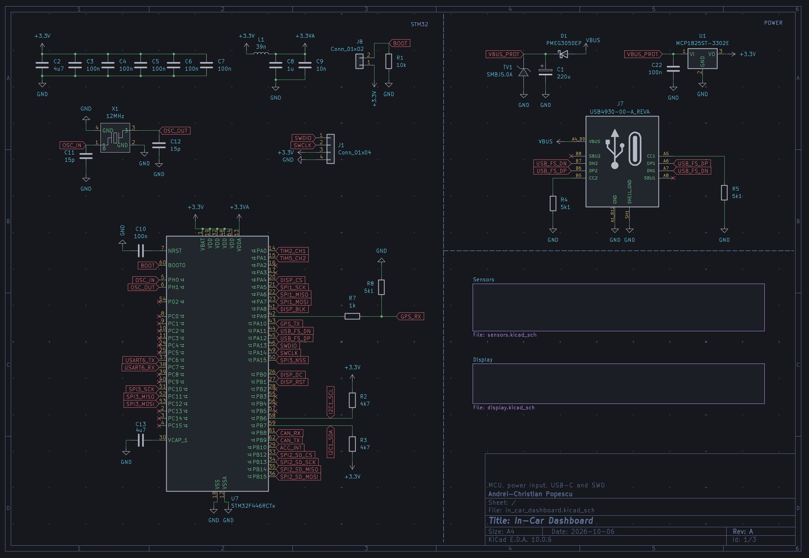
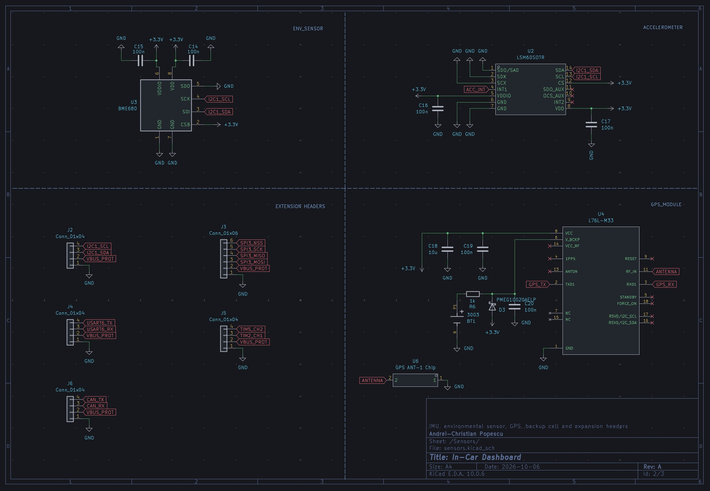
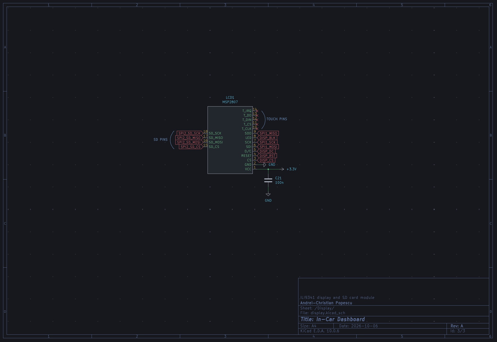
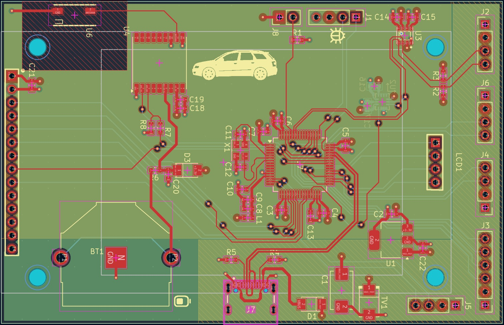

# In-Car Dashboard

A standalone telemetry display for a car: a custom 4-layer STM32 board with a 2.8" TFT, a 6-axis IMU, an environmental sensor and a GPS module. It powers from the car's 12 V socket through an ordinary USB-C car charger, starts a fresh session on every power-on with no buttons, shows live driving numbers, and writes a summary of each drive to an SD card.



## What it shows and records

**Live, on the screen**
- A G-meter: a dot for the acceleration you feel, its magnitude, and the session's hardest braking, acceleration and cornering each way around the ring
- Speed, session maximum and distance (GPS)
- Temperature, humidity, pressure and gas resistance (BME680)
- Local time, time since power-up, satellites, position and altitude (GPS fused with the barometer)

**Per drive, on the SD card** — one file, `SESSIONS.JSON`, a single valid JSON document with one fixed-size block per drive:
- Start time (UTC and local), duration, moving time, distance, top speed
- Hardest acceleration, braking and cornering, worst lateral load against the car's rollover limit
- Peak pitch and roll and how close they came to the car's limits
- Temperature, pressure and humidity min/max/average; climb and descent
- A `faults` section with every init result and error counter, so a drive that went wrong says so in its own record

The record is rewritten in place every 10 s, because the car cuts power without warning. A cut can only ever damage the current drive's block, and the two writes that move the closing bracket are ordered so an interrupted one repairs itself on the next boot.

## Hardware

| Part | Role | Interface |
|---|---|---|
| STMicroelectronics STM32F446RCT6 | Cortex-M4F MCU, 180 MHz, 256 KB flash, 128 KB RAM | — |
| STMicroelectronics LSM6DSOTR | 6-axis accelerometer + gyroscope | I2C1, data-ready on INT1 |
| Bosch Sensortec BME680 | Temperature, pressure, humidity, gas | I2C1 |
| Quectel L76L-M33 | GPS + GLONASS receiver, 1 Hz NMEA | USART1, 9600 baud |
| GPS ANT-1 chip antenna | Passive GNSS antenna | RF_IN |
| KMRTM28028-SPI / MSP2807 | 2.8" 320×240 TFT, ILI9341 driver, full-size SD socket | SPI1 (display), SPI2 (SD) |
| Microchip MCP1825ST-3302E | 3.3 V LDO | — |
| GCT USB4930-00-A | USB-C: power, and a USB CDC debug console | USB OTG FS |
| Keystone 3003 | Coin-cell holder for the GPS backup supply | V_BCKP |

Protection on the 5 V input: a series Schottky against reverse polarity, a TVS diode and a 220 µF tantalum bulk capacitor. Five expansion headers (I2C, SPI3/I2S3, USART6, CAN1, two 32-bit timer channels) carry the protected 5 V rail for future add-on boards. Flashing and debugging go through a 4-pin SWD header with an ST-Link.

- **PCB:** 4-layer FR4, 1.6 mm, ENIG (two LGA sensors), 61.6 × 95.79 mm. Solid ground on In1, 3.3 V pour on In2. Made at JLCPCB.
- **Schematic:** three sheets, pictured below, or open the KiCad project.
- **Parts list:** [`docs/bom.csv`](docs/bom.csv), with manufacturer part numbers.

<p>
  
  
</p>

**Display mounting.** The display module is not soldered to the board and does not appear in the renders: female 2.54 mm sockets are soldered into all 18 LCD1 positions (the 14-pin display and touch row and the 4-pin SD row), and male headers on the module's own PCB plug into them, so the screen stacks face-up on top of the main board and can be lifted off. The board's four M3 holes match the module's 44 × 76.08 mm hole pattern, for standoffs between the two.

### Case

A 3D-printed bottom tray holds the board by its walls, with the USB-C opening on one side, intake vents at the BME680 end and exhaust vents at the far end. Source: [`hardware/case/bottom_tray.FCStd`](hardware/case/bottom_tray.FCStd) (FreeCAD 1.1), described in [`docs/dash_case.md`](docs/dash_case.md). The top case with the display bezel and SD slot is not designed yet.



### Schematic and layout









### Known issues on this revision

- **No copper keepout under the GPS antenna.** The antenna's datasheet asks for a copper-free corner on all layers; it was missed. With solid copper underneath, the module heard nothing, so the chip antenna is lifted about 1 cm above its pads on two wire stubs; it fixes with 9–16 satellites that way. A rev B would add the keepout or a U.FL connector for a patch antenna.
- **The display module never drives its SDO line,** so register reads return `0xFF`. The firmware treats the ID check as advisory; writes work normally.
- **The IMU sits on the underside of the board,** so the firmware's axis map flips two axes. This is by design, but it surprises anyone reading raw values.

## Firmware

C, bare-metal superloop on STM32 HAL (CubeMX-generated init), built with CMake and arm-none-eabi-gcc. No RTOS yet.

The loop is paced by the IMU's own data-ready interrupt at about 105 Hz. Each sample is mapped from sensor axes to vehicle axes (ISO 8855: X forward, Y left, Z up), run through the attitude filter, then handed to the trip statistics. Around that, on every pass:
- the GPS ring buffer is drained and NMEA sentences parsed
- the BME680 is triggered and read back in two halves every 3 s, so nothing blocks
- the screen redraws at 20 Hz, one 16-line band per pass, with no framebuffer
- the session record is rewritten every 10 s

| Stack | Modules |
|---|---|
| Sensors | `i2c_bus` → vendor drivers (ST `lsm6dso`, Bosch `BME68x`) → platform glue → `imu`, `env` |
| GPS | `uart_bus` (interrupt-driven ring buffer) → `nmea` (parser) → `gps` |
| Fusion and statistics | `attitude` (complementary filter, full Euler kinematics, mount rotation), `trip` (distance, peaks, lean, rollover margins, GPS-dropout coasting), `elevation` (GPS altitude fused with barometric pressure) |
| Display | `lcd` (ILI9341 over SPI) → `gfx` (band renderer, dirty rectangles) → `screen` |
| Storage | `sd_spi` (SD SPI mode, CRC on every command and block) → FatFs → `session_record` → `session_log` |
| Console | `usb_serial` (printf over USB CDC) → `console` |

Everything with no hardware in it is host-testable and tested on a PC, 243 checks across seven modules: `nmea`, `attitude`, `trip`, `elevation`, `gfx`, `sd_crc`, `session_record`. Expected values come from independent derivations rather than restatements of the code under test. Car- and mount-specific constants (axis map, calibration, wheelbase, track, centre-of-gravity height) live in one header, `firmware/App/Inc/vehicle_axes.h`, explained in [`docs/vehicle_info.md`](docs/vehicle_info.md).

Some decisions worth knowing before changing anything:
- **Pitch and roll come from accelerometer and gyroscope fused.** The car's own acceleration is subtracted first, using GPS speed and speed × yaw rate, so braking and cornering don't read as tilt.
- **GPS speed below 10 km/h is treated as standing still.** A poor fix wanders by several km/h at rest, so the floor is applied once, where the fix enters the trip statistics.
- **Climb and descent come from the barometer alone.** The GPS height after a cold start drifts by up to hundreds of metres over minutes, and counting that as climb was a real bug.
- **The mount is calibrated in the car,** with the board's rest reading measured in both directions on the same spot and averaged, so a sloping parking space cancels out.

The reasoning behind these and most other choices, written down while I learned embedded from scratch, is in [`docs/notes.md`](docs/notes.md); code comments that say "see docs/notes.md" point there.

## Repository layout

```
firmware/            STM32 firmware (CMake, CubeMX project dashboard_firmware.ioc)
  App/               hand-written code: Inc/, Src/, Drivers/ (vendor), Fonts/ (generated)
  Core/ Drivers/ FATFS/ Middlewares/ USB_DEVICE/   CubeMX- and ST-generated
  tests/             host tests, each file carries its own compile line
  tools/             font generator
hardware/
  pcb/               KiCad 10 project in_car_dashboard
  libraries/         custom symbols, footprints and 3D models used by the board
  case/              FreeCAD source of the case tray
docs/                case design note, the car's numbers and what each one is used for, my notes
                     from building it, schematic and board pictures, renders, BOM
```

## Building and flashing

Requirements: CMake ≥ 3.22, Ninja, and `arm-none-eabi-gcc` on the `PATH` (STM32CubeCLT provides all three).

```sh
cd firmware
cmake --preset Debug
cmake --build build/Debug
```

The output is `build/Debug/dashboard_firmware.elf`. Flash it over SWD with an ST-Link: from an IDE (CLion with the STM32 plugin, or STM32CubeIDE), or with STM32CubeProgrammer. The serial console is the USB-C port itself, at `/dev/cu.usbmodem*` on macOS; the baud rate is ignored.

Host tests build with any C11 compiler. For example:

```sh
cd firmware
cc -std=c11 -Wall -Wextra -I App/Inc tests/test_trip.c App/Src/trip.c -lm -o /tmp/test_trip && /tmp/test_trip
```

Each file in `tests/` has its own line in its header.

## Opening the hardware

- **PCB:** open `hardware/pcb/in_car_dashboard.kicad_pro` in KiCad 10. The project's symbol and footprint paths are relative to the project, so the custom parts in `hardware/libraries/` resolve on any machine; everything else comes from KiCad's standard libraries. The 3D models of the custom parts are not included, since they come from third parties: the board opens, checks and exports normally, and those parts just show without a body in the 3D viewer. To get them back, download the STEP models from the manufacturers and put each in `hardware/libraries/<library>/<library>.3dshapes/` under the file name its footprint asks for.
- **Case:** open `hardware/case/bottom_tray.FCStd` in FreeCAD 1.1. It was printed in one piece, floor down, no supports.

## Datasheets

Not included in the repository; all are available from the manufacturers:
- STM32F446RC (STMicroelectronics)
- LSM6DSO (STMicroelectronics)
- BME680 (Bosch Sensortec)
- L76L-M33 datasheet and its GNSS protocol specification (Quectel)
- ILI9341 (Ilitek)
- MSP2807 / KMRTM28028-SPI module drawing
- MCP1825 (Microchip)
- USB4930 / USB4940 (GCT)
- 3003 coin-cell holder (Keystone)
- PMEG10020AELP and PMEG3050EP Schottky diodes (Nexperia)
- SMBJ5.0A TVS diode (SMBJ series)
- GPS ANT-1 chip antenna
- SD Physical Layer Simplified Specification v2.00 (SD Association)

## Status

Working on the bench and in the car. Bring-up is complete: console, sensors, calibration, GPS, attitude, interrupt-paced sampling, display, SD logging and the main loop. The first long drive, 118.5 km, matched the route distance and ran with every fault counter at zero.

Still to do:
- Air-quality index through Bosch's BSEC library, which is closed source and won't be in this repository
- Tuning the filters against logged drives, and a faster GPS rate
- The top case
- A second screen for pitch and roll off-road

## License

The hardware design, case, firmware and documentation in this repository are released under the [MIT License](LICENSE).

The custom symbols and footprints in `hardware/libraries/` were drawn from, or adapted from, manufacturer and EasyEDA / SnapEDA sources; their 3D models are not redistributed here.

Third-party code keeps its own licence:
- **CMSIS:** Apache 2.0, see `firmware/Drivers/CMSIS/LICENSE.txt`
- **STM32F4 HAL:** BSD-3-Clause, see `firmware/Drivers/STM32F4xx_HAL_Driver/LICENSE.txt`
- **STM32 USB Device Library:** ST SLA0044, see `firmware/Middlewares/ST/STM32_USB_Device_Library/LICENSE.txt`
- **FatFs R0.12c:** ChaN's FatFs licence, in its source header
- **Bosch BME68x SensorAPI:** BSD-3-Clause
- **ST LSM6DSO driver:** BSD-3-Clause, from ST's `lsm6dso-pid` repository
